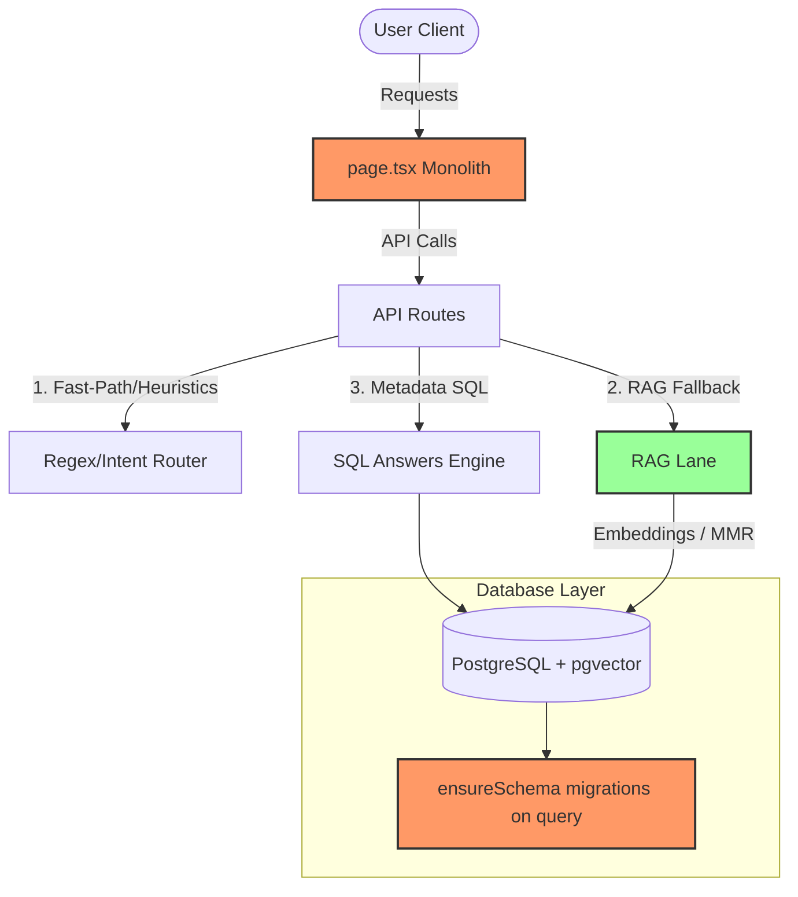

# Senior Engineer Code Review & Assessment Report
**Project:** Notion AI Chat Assistant
**Assessed By:** Senior Software Engineer / Team Architect
**Target Audience:** Engineering Team & Management
**Overall Rating:** **7.5 / 10** (B / B+)

---

## 1. Executive Summary
The **Notion AI Chat Assistant** is a promising RAG-based application designed to bridge the gap between static Notion documentation and natural language queries. For a codebase created primarily by junior developers, it displays a surprising level of maturity in its search and retrieval algorithms, using advanced concepts like **Maximal Marginal Relevance (MMR)**, **Multi-Query Expansion**, and **Query Reformulation**.

However, the project contains significant architectural anti-patterns, structural maintenance debt, and a couple of high-risk hacks that would make it difficult to scale and maintain in a high-traffic, production-grade cloud environment.

With proper refactoring (especially around frontend component decomposition, database migration strategies, and removing runtime network hacks), this project can easily transition to a solid **9/10** enterprise utility.

---

## 2. The Good (High-Maturity Strengths)
Several advanced features are implemented exceptionally well, showing that the developers did thorough research on state-of-the-art RAG architectures:

### A. Advanced RAG & Retrieval Logic
* **Maximal Marginal Relevance (MMR) & Deduplication:** Located in `src/lib/rag/mmr.ts`, the implementation uses MMR to diversify context chunks. This prevents the LLM from being flooded with redundant passages, optimizing token usage.
* **Hybrid Search:** Combines pgvector semantic similarity search with PostgreSQL Full-Text Search (FTS) and explicit title keywords boost. This ensures search queries find both concept-based matches and exact keyword lookups.
* **Query Reformulation:** Reformulates vague follow-up queries (e.g., "what about it?") based on conversation history, resolving pronouns before performing retrieval.
* **Multi-Query Expansion:** Automatically expands single queries into multiple variations via the LLM to maximize recall.

### B. Ingestion Performance Optimizations
* **Parallel Processing:** Uses a custom concurrency limiter (semaphore-based) in `src/lib/ingestion/sync.ts` to fetch blocks and process pages in parallel (defaulting to 8), preventing API lockups while achieving ~8x speedups.
* **Batch Database Operations:** Rather than looping individual `INSERT` statements for chunks, the code builds arrays and performs a single bulk `INSERT` using PostgreSQL `UNNEST`. This eliminates significant network round-trip overhead.
* **Resume Support:** Supports resuming crashed sync runs using page status checks (`synced_at`, `embedding_status`), saving both time and API credits.

### C. UX & Business Intelligence Value
* **Tone & Emotion Adjuster:** A creative feature that uses LLMs to analyze user sentiment/emotion and adapts the bot's response tone (e.g., warmer emoji for happy, action-oriented for frustrated).
* **Built-in Cost & Budget Tracking:** Calculations in `/cost-report` and `AwsComputeCost.ts` estimate real-time model and infrastructure costs per user based on character-to-token count heuristics. This is highly useful for cost monitoring.

---

## 3. What Needs Improvement (Technical Debt & Code Quality)
These are areas where the codebase deviates from best practices, making it harder to maintain or adapt:

### A. Monolithic Page Component (`src/app/page.tsx`)
* **The Problem:** The main chat view is a single `page.tsx` file consisting of **1,327 lines of code (53KB)**. It handles sidebar state, active sessions, deletion confirmations, markdown rendering, input form handling, and sync control API calls all in one place.
* **The Fix:** Decompose `page.tsx` into smaller, focused React components (e.g., `<Sidebar />`, `<ChatArea />`, `<MessageBubble />`, `<SyncDialog />`) and abstract complex state management into custom hooks (e.g., `useChatSession`, `useSyncKB`).

### B. Runtime Database Schema Management
* **The Problem:** The database client (`src/lib/db/postgres.ts`) automatically triggers schema checks and advisory lock-guarded table creation migrations (`ensureSchema()`) on *every single query import*. 
* **Why it's bad:** Doing DDL schema setup at runtime slows down cold-start responses, introduces database locking contention in multi-container setups, and forces the web application's database role to have full DDL/Owner privileges instead of read/write only.
* **The Fix:** Switch to a standard database migration tool (like Prisma Migrations, Drizzle Kit, Knex, or db-migrate) to apply database schemas out-of-band during the CI/CD pipeline or deployment phase.

### C. Hardcoded Business/Workspace Logic
* **The Problem:** The SQL answer engine (`src/lib/sql/answers.ts`) contains hardcoded project definitions (`PROJECT_THEMES` like "Meraki", "Oscar", "DataPivots AI").
* **Why it's bad:** This ties the application directly to the specific internal structures of one company/workspace.
* **Fix:** Pull these configurations out into environment variables, database configuration tables, or configure them through a tenant settings UI.

### D. Missing Standard Testing Framework
* **The Problem:** Tests (like E2E regressions) are run using custom standalone scripts (`scripts/e2e-pipeline-test.ts`) executed manually via `tsx`.
* **The Fix:** Integrate a formal testing library like **Vitest** or **Jest** for unit/integration tests and **Playwright/Cypress** for E2E tests to obtain standardized test reports and assertion checks.

---

## 4. The Worst (Critical Anti-Patterns & Risk Factors)
These are high-priority issues that represent security risks or fragile workarounds that should be resolved immediately:

### A. Network Monkeypatching (`src/lib/dns-hook.ts`)
* **The Problem:** The file intercepts and overrides Node's core `dns.lookup` function globally to force DNS resolution to IPv4 for specific hosts (e.g. Neon, Google, OpenAI).
* **Why it's dangerous:** Globally monkeypatching low-level Node.js standard libraries to solve local dual-stack or misconfigured network timeouts is extremely brittle. It can lead to hard-to-debug network issues, proxy compatibility errors, and potential socket leaks in production servers.
* **The Fix:** Remove `dns-hook.ts`. Network/IPv6 lookup latency issues should be handled at the container/orchestrator level (e.g. system `/etc/resolv.conf` settings) or by configuring agent connections in the library clients (e.g., using `family: 4` in `pg` pool settings or specific agent settings in fetch options).

### B. Route Typo in API Structure
* **The Problem:** The API route folder for the cost reporting is named `cosr-report` (a typo: "cosr" instead of "cost"), making the route `/api/cosr-report/llm-usage`.
* **Why it matters:** Though the frontend page fetches from the matching typo route, it is highly unprofessional, violates URL naming conventions, and makes API maintenance confusing.
* **The Fix:** Rename the directory `src/app/api/cosr-report` to `src/app/api/cost-report` and update the fetch call in `src/app/cost-report/CostReportPage.tsx`.

---

## 5. Architectural Assessment & Recommendations

### Key Recommendations Roadmap:
1. **Remove `dns-hook.ts`:** Identify the root cause of IPv6 timeouts on the developer's local networks and configure the environment properly without patching Node core.
2. **Decompose `page.tsx`:** Split the UI file into logical components located in `src/components/chat/`.
3. **Migrate to Drizzle/Prisma:** Adopt a proper database schema management tool and remove the self-migrating runtime Postgres driver.
4. **Fix API Typo:** Rename `cosr-report` to `cost-report` and align the frontend fetch requests.
5. **Decouple SQL Answer Heuristics:** Replace hardcoded project themes with dynamic SQL groupings (e.g. querying distinct page tags, directories, or categories in Notion metadata).
