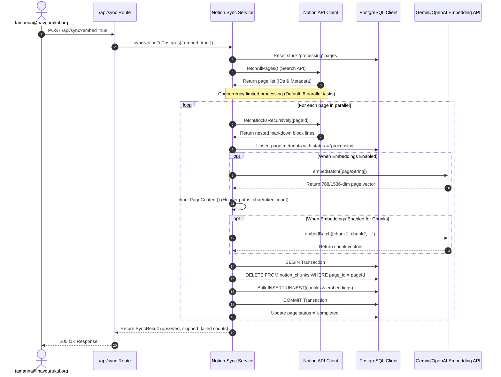
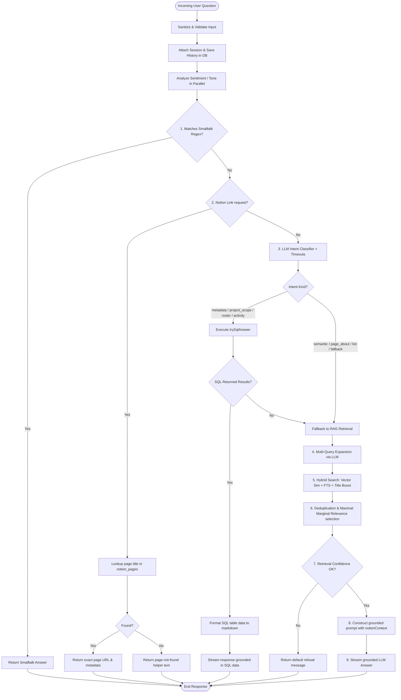

# Software Design & Architecture Diagrams
**Project:** Notion AI Chat Assistant
**Scope:** Architecture, Ingestion Pipeline, and Query Routing Data Flow

---

## 1. High-Level System Architecture
This diagram illustrates the overall system components, authentication middleware, API route layer, and interactions with external services (Notion API, LLM/Embedding providers).

```mermaid
graph TB
    subgraph Client Layer [Client Application]
        UI[Next.js Client SPA]
    end

    subgraph Authentication Gate [Security & Auth]
        Middleware{Next.js Middleware}
        NextAuth[NextAuth.js Google OAuth]
        RateLimit[Rate Limiter]
    end

    subgraph Application Backend [Next.js App Router]
        API_Chat[/api/chat POST]
        API_Chats[/api/chats GET/POST/DELETE]
        API_Sync[/api/sync GET/POST]
        API_Cost[/api/cost-report GET]
        
        SyncService[Notion Sync Service]
        Pipeline[Chat Pipeline Runner]
        SQLAnswers[SQL Answers Engine]
    end

    subgraph Knowledge Base Ingestion [Data Ingest]
        Chunker[Semantic Chunker]
        EmbedBatch[Embedding Batcher]
    end

    subgraph Data Stores [Database Layer]
        Postgres[(PostgreSQL DB)]
        pgvector[(pgvector Extension)]
    end

    subgraph External Services [SaaS APIs]
        NotionAPI[[Notion SDK / API]]
        LLM[[Gemini / DeepSeek API]]
    end

    %% Client and Auth Flow
    UI -->|Navigate / API request| Middleware
    Middleware -->|Require Session| NextAuth
    NextAuth -->|Allow Domain Check| UI
    UI -->|POST /api/chat| RateLimit
    RateLimit -->|If Allowed| API_Chat

    %% API Routes Interactions
    API_Chat --> Pipeline
    API_Sync --> SyncService
    API_Cost --> Postgres

    %% Sync / Ingestion Flow
    SyncService -->|1. Fetch Pages| NotionAPI
    SyncService -->|2. Extract Blocks| NotionAPI
    SyncService -->|3. Chunk Pages| Chunker
    Chunker -->|4. Generate Vectors| EmbedBatch
    EmbedBatch -->|5. Vector APIs| LLM
    SyncService -->|6. Batch Insert UNNEST| Postgres

    %% Pipeline and Query Routing
    Pipeline -->|Intent Detection| LLM
    Pipeline -->|Semantic Retrieval| pgvector
    Pipeline -->|Metadata Retrieval| SQLAnswers
    SQLAnswers --> Postgres
    Pipeline -->|Final Context Prompt| LLM
    LLM -->|Stream Answer| UI

    classDef store fill:#3b82f6,stroke:#1d4ed8,color:#fff;
    classDef ext fill:#10b981,stroke:#047857,color:#fff;
    class Postgres,pgvector store;
    class NotionAPI,LLM ext;
```

---

## 2. Ingestion & Synchronization Pipeline (Notion -> DB)
This flowchart shows how the system reads content from Notion workspace databases, splits it into semantic chunks, generates vectors, and upserts them to PostgreSQL in concurrency-controlled batches.



---

## 3. Query Routing & Resolution Pipeline (/api/chat)
This diagram illustrates the hybrid routing engine. The system routes questions through smalltalk fast-paths, Notion page link matches, dynamic metadata queries, or falls back to hybrid semantic search + streaming LLM grounding.


