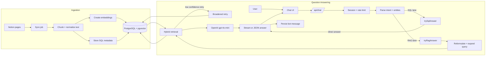
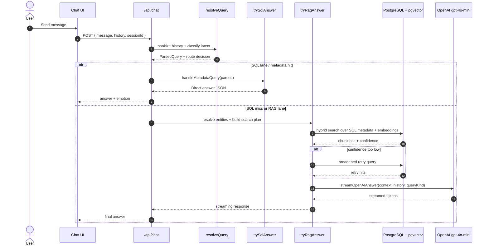

# Architecture Overview

The Notion AI Chat Assistant uses a **RAG (Retrieval-Augmented Generation)** pattern to provide accurate answers based on your Notion data.

## 🏗 High-Level Flow

1. **Notion Ingestion & Chunking**: Workspace pages from Notion are stored and chunked into PostgreSQL with `pgvector` embeddings (`text-embedding-3-small`).
2. **Intent Classification & Routing**: Incoming queries are parsed via regex rules or OpenAI intent classification (`gpt-4o-mini`).
3. **Context Retrieval & SQL Execution**: The backend routes queries to direct SQL answers or vector-hybrid RAG retrieval.
4. **AI Response Streaming**: Context and prompt are sent to OpenAI (`gpt-4o-mini`), which streams back the response to the user.

## 🔁 Full Data Flow

## 🛠 Key Tech Choices

- **Next.js**: For both the frontend UI and serverless API routes.
- **NextAuth**: For secure Google OAuth handling.
- **Neon PostgreSQL + pgvector**: For SQL metadata storage and vector similarity retrieval.
- **Notion SDK**: Official client for workspace sync.
- **OpenAI SDK**: Sole AI provider for embeddings (`text-embedding-3-small`), intent classification, and chat streaming (`gpt-4o-mini`).
